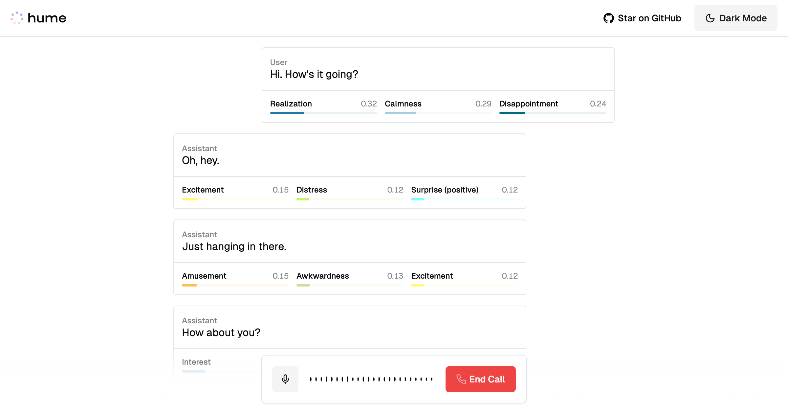

  
  <h1>EVI Memory PoC</h1>

## Overview

Proof of concept of memory for the consumer app, using an interactive approach (approach #4 below, option #1 for the proof of concept). Uses the Vercel EVI example as a starting point.

<aside>

🔗 **Related: [PDD | Memory for EVI](https://www.notion.so/PDD-Memory-for-EVI-465888451e5546d8ad706a72a784faed?pvs=21)**

</aside>

## Problem

The consumer app currently has **~4.75% D7 retention** ([src](https://us.posthog.com/project/90814/insights/6rl8Synh), [src](https://appstoreconnect.apple.com/analytics/app/d30/6502917807/retention?startDate=d%3A20241008)), significantly below the industry benchmark of **12%** for excellent consumer mobile apps ([src](https://www.adjust.com/blog/what-makes-a-good-retention-rate/)). User feedback and strategic analysis suggest that implementing **memory features** could improve retention - making conversations more personal, engaging, and valuable over time. This creates switching costs and deepens user engagement, as users would need to rebuild context when moving to other AI apps that will feel more like generic strangers rather than a helpful companion or friend.

🎯 **Goal:** Implement memory features that help increase our D7 retention to ≥10% - a great sign that the app is working well and sticky enough to start pushing on growing the top of funnel.

## Possible implementations

### 1. Memory frameworks/agents

Implementation using existing frameworks like [mem0](https://github.com/getmemo/mem0), [zep](https://docs.getzep.com/), or something like [New Computer's agentic memory system](https://blog.langchain.dev/customers-new-computer/). These frameworks provide architectures for managing AI memories.

The implementation involves integrating a dedicated memory management system that handles: persistent storage of conversation memories, contextual retrieval based on relevance, memory state management across sessions, and intelligent recall mechanisms.

- 🔹 Sophisticated memory management with relatively proven implementations
- 🔹 Handles complex memory operations and retrieval
- 🔻 Significant technical complexity and overhead, and less customizability
- 🔻 May introduce latency issues
- 🔻 Overkill for us for now - overengineered for current needs

### 2. `save_memory` tool

Single tool approach where the LLM uses a dedicated tool to save memories during conversation. The implementation involves adding a tool that saves memories to an external store during chat. Memories are saved but don't update the prompt within the current chat. External store is used to construct memory section of the prompt for future chats. Relies on the LLM's ability to identify important information to save, but then uses attention to retrieve.

- 🔹 Simple implementation with single decision point
- 🔹 Real-time memory storage during conversation
- 🔻 Memories don't live-update within current chat
- 🔻 Requires tool use during conversation, which may interrupt flow
- 🔻 Relies on the LLM's ability to follow pretty nuanced instructions

### 3. `save_memory` and `use_memory` tools

Dual tool approach implementing separate mechanisms for memory storage and retrieval. The implementation involves two distinct tools: one for writing memories, one for reading. An external memory store that can be queried would be created, and the LLM decides when to save and when to retrieve memories from this store. Could potentially implement search/RAG over memory store.

- 🔹 Separate concerns for reading and writing
- 🔹 Flexible memory retrieval options
- 🔻 Adds a second point of failure with two decision points
- 🔻 LLM won't know when to use read_memory if it doesn't know what memories it has
- 🔻 No clear caching benefit since prompt caches are only live for 5 mins anyway
- 🔻 If reading appends entire memory, no advantage over simpler approaches
- 🔻 If implementing search/RAG, adds unnecessary technical complexity

### ⭐ 4. Extracting memories from chats and appending

Process entire conversations post-chat to extract and save memories to the prompt. The implementation involves: a single LLM call after each chat session, which takes entire conversation and extracts important details as memories. It then saves these extracted memories to the prompt for future session. No in-conversation memory management needed. Can use consistent LLM (e.g., Claude 3.5 Sonnet) and static prompt for memory extraction.

- 🔹 Simplest implementation approach
- 🔹 No interruption to conversation flow
- 🔹 Can use consistent LLM for memory extraction
- 🔹 Natural memory integration via prompt attention
- 🔹 Prompt makes it easier for the model to attend to the memories, like chain of thought
- 🔻 Requires processing full chat history
- 🔻 Need to manage prompt size over time
- 🔻 May have "compression problems" with repeated extractions

## Selected implementation

Extracting memories from chats and appending them was chosen for its simplicity and effectiveness. This approach allows for natural conversation flow & consistent memory extraction, without requiring complex architectural changes or introducing extra latency.

### Option 1: Interactive interface

A live testing environment using the [Vercel template](https://vercel.com/templates/next.js/empathic-voice-interface-starter) to simulate EVI with memory capabilities.

Implementation steps:

1. Set up Vercel template with chat interface: https://vercel.com/templates/next.js/empathic-voice-interface-starter. This has basic EVI chat functionality
2. Add post-chat memory extraction system:
    - Define and test a memory extraction prompt, which should run after each chat
    - Implement memory storage (just store memories in a JSON file)
    - Create memory appending mechanism, which just appends the extracted memories
3. Add chat retrieval system:
    1. Retrieve the chat transcripts with the get chat events API endpoint: https://dev.hume.ai/reference/empathic-voice-interface-evi/chats/list-chat-events
    2. Parse out the transcript with just the user and assistant messages in order
    3. Execute memory extraction: pass this transcript with the memory prompt to the LLM to extract memories
4. Add memory prompt visualization features:
    - Display the current memory prompt section in the side of the interface, showing what it currently is at all times in the chat. Lets the user see the changes over time.
5. Implement proactive memory gathering:
    - Create a prompt that asks natural get-to-know-you questions over time, gathering memories about the user that can then be extracted.
6. Test this proof of concept in a series of chats to see how well it works

Pros and cons:

- 🔹 Real-world testing environment
- 🔹 Immediate feedback on memory quality
- 🔹 Can test user interaction patterns
- 🔻 Somewhat more complex to implement
- 🔻 Requires frontend development
- 🔻 Takes longer to get results

## Option 2: Synthetic data evaluation

A data-driven approach using synthetically generated conversations to evaluate memory extraction effectiveness.

Implementation steps:

1. Generate synthetic chat data:
    - Use Claude to create diverse conversation scenarios
    - Include various user personalities and topics
    - Generate multiple chat sessions per user
2. Develop memory extraction system:
    - Create extraction prompt
    - Define memory formatting rules
    - Implement extraction pipeline
3. Run comparative analysis:
    - Process chats with full history vs. extracted memories
    - Test memory recall accuracy
    - Evaluate conversation personalization
    - Measure memory relevance
4. Analyze results:
    - Compare memory usage effectiveness
    - Assess information retention
    - Evaluate personalization quality

Pros and cons:

- 🔹 Faster to implement
- 🔹 Controlled testing environment
- 🔹 Easier to measure specific metrics
- 🔻 May not capture real user behavior
- 🔻 Limited to synthetic scenarios
- 🔻 Requires careful prompt engineering for synthetic data